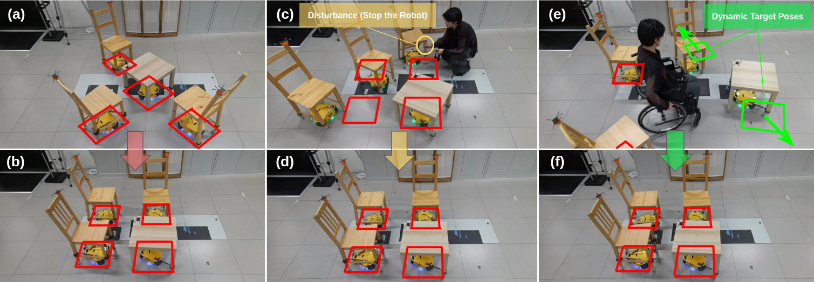
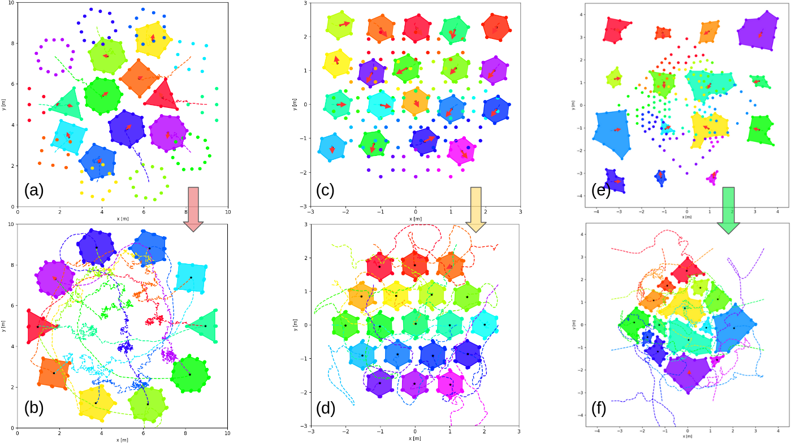
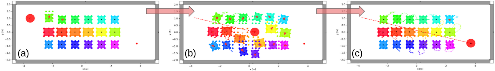

# Velocity Potential Field Modulation for Dense Coordination of Polytopic Swarms and Its Application to Assistive Robotic Furniture
This repository contains the source code of the paper "Velocity Potential Field Modulation for Dense Coordination of Polytopic Swarms and Its Application to Assistive Robotic Furniture", IEEE Robotics and Automation Letters (Volume: 10, Issue: 7, July 2025) 

| **[`IEEE_Xplore`](https://ieeexplore.ieee.org/document/11027457)** |



## Citation
```
@ARTICLE{11027457,
  author={Tang, Lixuan and Rüegg, David and Zhang, Runze and Bolotnikova, Anastasia and Rabaey, Jan and Ijspeert, Auke},
  journal={IEEE Robotics and Automation Letters}, 
  title={Velocity Potential Field Modulation for Dense Coordination of Polytopic Swarms and Its Application to Assistive Robotic Furniture}, 
  year={2025},
  volume={10},
  number={7},
  pages={7452-7459},
  keywords={Robots;Robot kinematics;Collision avoidance;Shape;Modulation;Dynamical systems;Wheelchairs;System recovery;Robot sensing systems;Mobile robots;Collision avoidance;path planning for multiple mobile robots or agents;swarm robotics},
  doi={10.1109/LRA.2025.3577423}}
```

## Prerequisite
- Ubuntu20.04 / Unbuntu22.04
- Python3.8 / Python3.10 
- virtualenv

## Installation 
Create a virtual environment inside the workspace folder /VPFM-BioRob-EPFL
```shell
git clone https://github.com/Mikasatlx/VPFM-BioRob-EPFL.git
cd VPFM-BioRob-EPFL

virtualenv venv
source ./venv/bin/activate

pip3 install -r requirements.txt
pip3 install -e .

cd autonomous_furniture/libraries/dynamic_obstacle_avoidance/
pip3 install -r requirements.txt
pip3 install -e .

cd libraries/various_tools/
pip3 install -r requirements.txt
pip3 install -e .
```

## Simulation Demos



Source the virtual environment inside the workspace folder /VPFM-BioRob-EPFL
```shell
source ./venv/bin/activate
```

### Antipodal Position Switching
```shell
python3 scripts/antipodal_position_switching.py
```

### Dense Reconfiguration of Regular Hexagon
```shell
python3 scripts/dense_reconfiguration_regular_hexegon.py
```

### Auto-assembly of Irregular Polytopic Parts
```shell
python3 scripts/auto_assembly_irregular_polytopic_parts.py
```



### Clear the Way for the User
```shell
python3 scripts/clear_way_for_user.py
```

## Acknowledgments
This work was supported by Project IMEC-EPFL.

This repository is developed based on the **[`dynamic_obstacle_avoidance`](https://github.com/epfl-lasa/dynamic_obstacle_avoidance)**

## Contact
Lixuan Tang (lixuan.tang@epfl.ch), Biorobotics Laboratory (BioRob), EPFL  

## References     
> [1] L. Huber, A. Billard, and J. -J. Slotine, “Avoidance of convex and concave obstacles with convergence ensured through contraction,” IEEE Robot. Automat. Lett., vol. 4, no. 2, pp. 1462–1469, Apr. 2019.
> 
> [2] F. M. Conzelmann, L. Huber, D. Paez-Granados, A. Bolotnikova, A. Ijspeert, and A. Billard, “A dynamical system approach to decentralized collision-free autonomous coordination of a mobile assistive furniture swarm,” in Proc. IEEE/RSJ Int. Conf. Intell. Robots Syst., 2022, pp. 7259–7265.
> 
> [3] Huber, Lukas. _Exact Obstacle Avoidance for Robots in Complex and Dynamic Environments Using Local Modulation._ No. 10373., EPFL, 2024.
>
> [4] L. -N. Douce, “Agent prioritization and virtual drag minimization in dynamical system modulation for obstacle avoidance of decentralized swarms,” in Proc. IEEE/RSJ Int. Conf. Intell. Robots Syst., 2023, pp. 1–7.